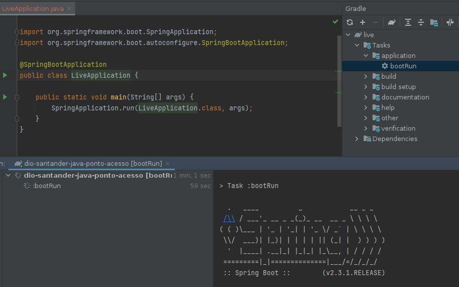
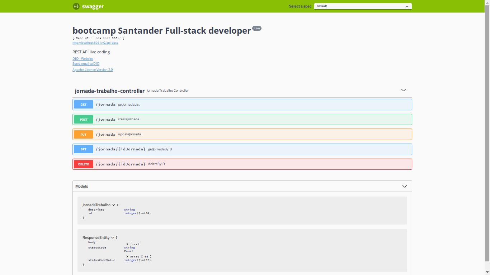

# DIO-santander-java-ponto-acesso

Este projeto faz parte do **Santander bootcamp** oferecido pela plataforma **Digital Innovation One**.   Trata-se de um controle de registro de pontos desenvolvido para empresas.

Autor: [ANDRE FELIPE]((https://github.com/andrephellipe))

> API REST para controle de ponto e acesso dos usuários de uma empresa. 

### Ambiente

- Java JDK 11
- Spring Boot
- Spring Data JPA
- Hibernate
- Lombok
- Swagger

### Passos para reproduzir

Execute a classe `com.dio.live.LiveApplication` 

Abra o seu navegador e digite `http://localhost:8081/swagger-ui.html`

Você verá uma página Swagger como nas capturas de tela:

